# Focused Phase 4.5 UX review evidence

Before/after captures use the pre-UX uncommitted Phase 4.5 visual implementation as their baseline. Desktop 1440×900; live traffic/sky animations are not frozen. Controls and profile comparisons use the same viewport and navigation target. Form content is illustrative QA input, not a real customer. The 1px local PNG upload appears black in the draft logo evidence.

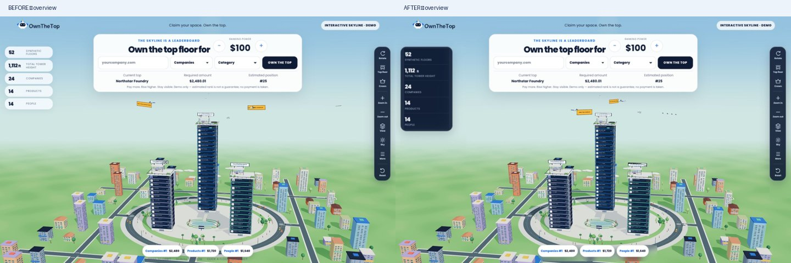

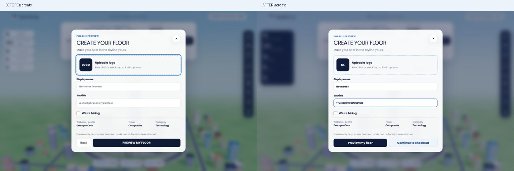

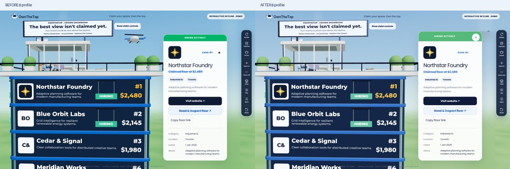

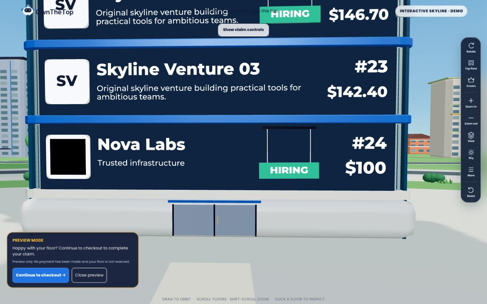

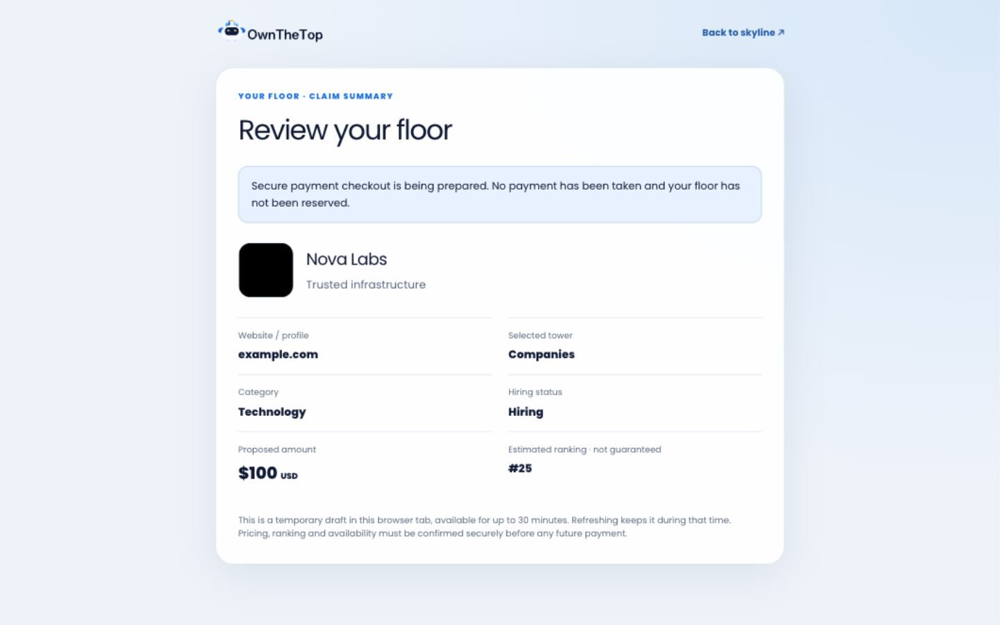

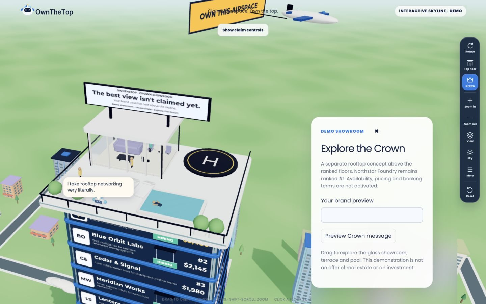

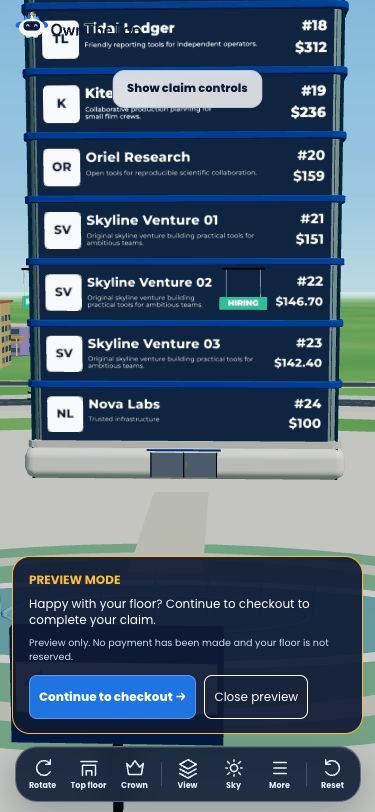

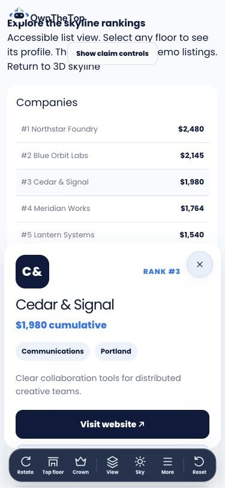

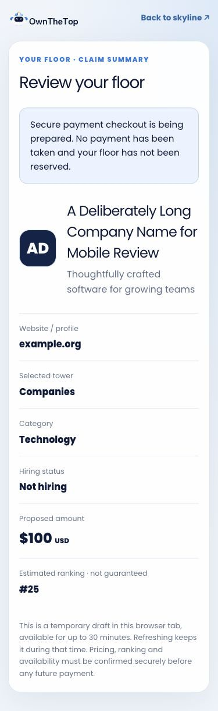

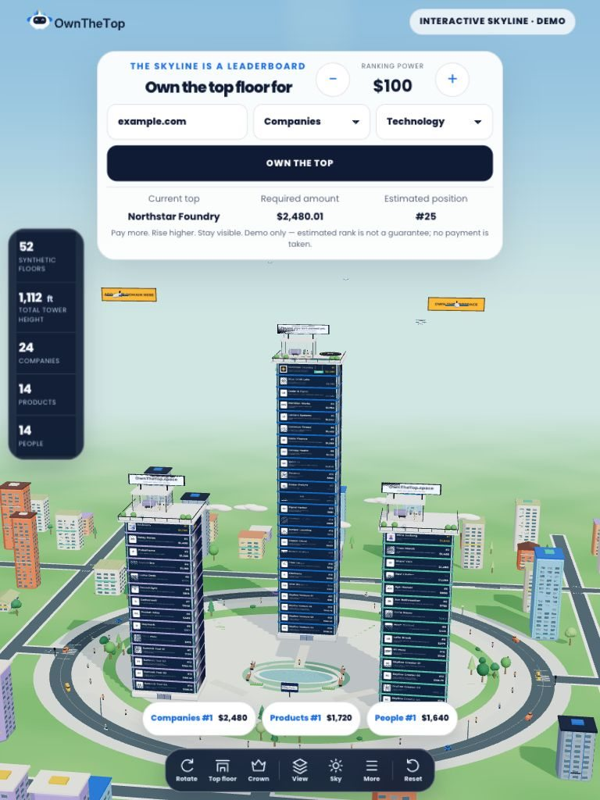

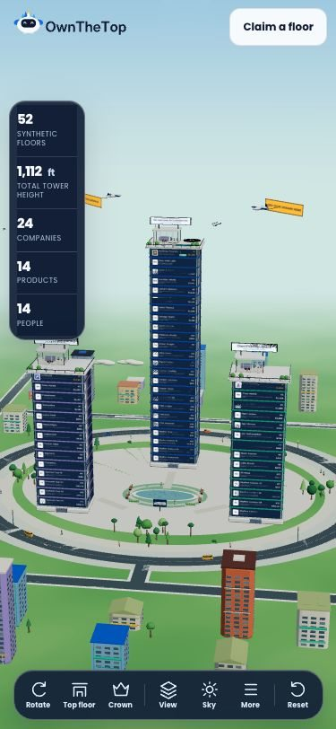

Visual assessment: navy statistics unify both sides without changing values. Primary Preview and secondary Checkout are visibly distinct; Back is absent. The preview CTA leaves the advertisement unobstructed in matched desktop and phone views. Checkout has a clear unpaid/unreserved disclosure and a complete summary. Mascot has its original pleasant bubble/tail without an X. Profile X is separate from logo/rank and clears the hiring strip. All captures reviewed; phone/tablet views are viewport emulation, not physical-device proof.
